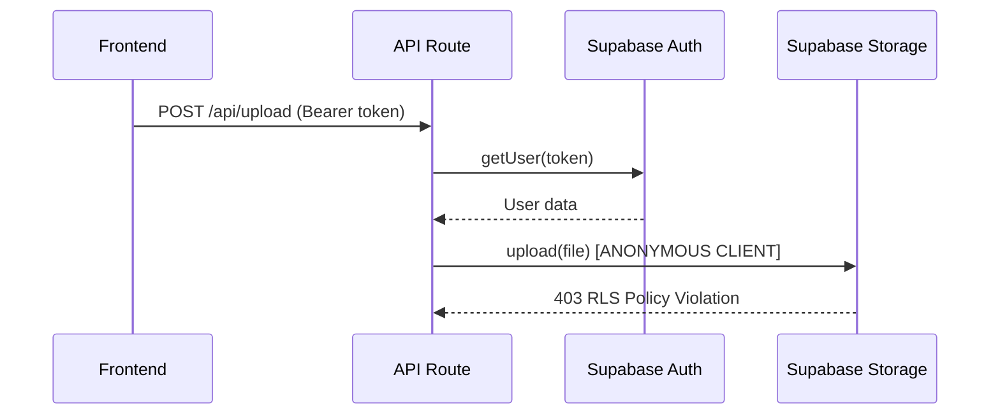
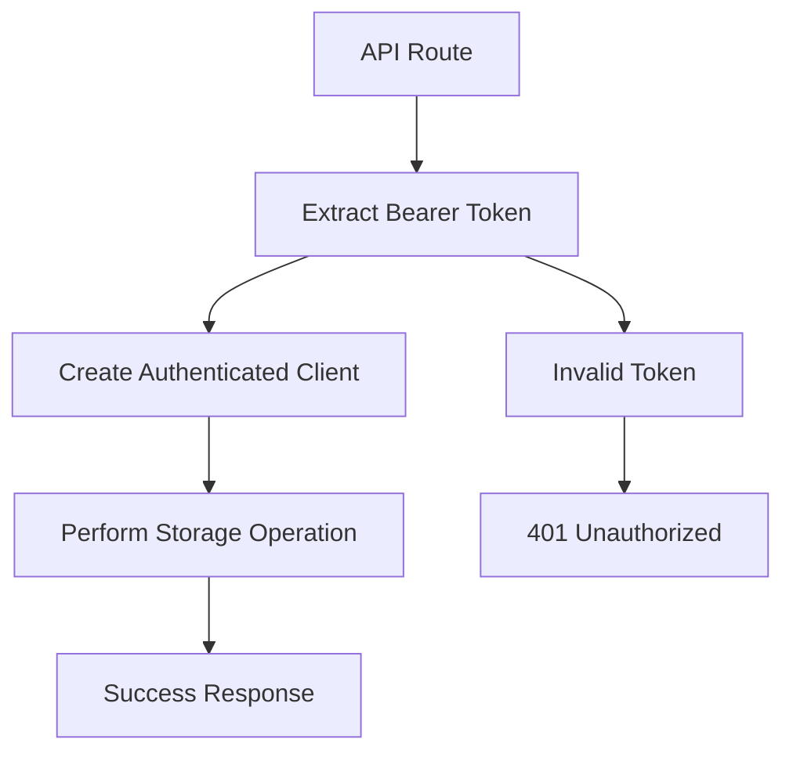
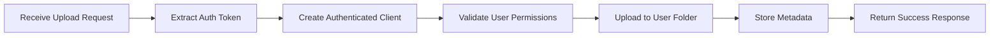
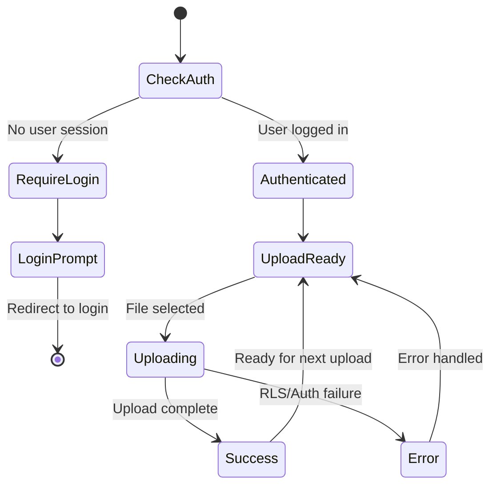
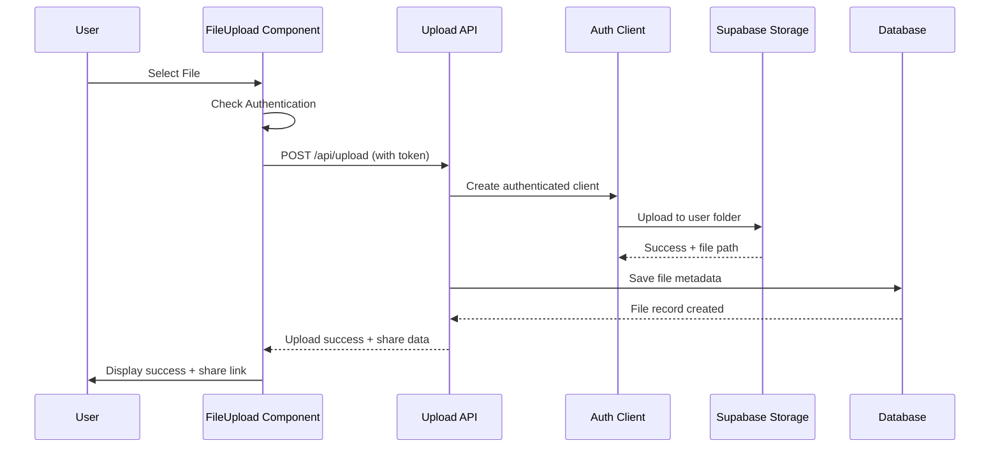
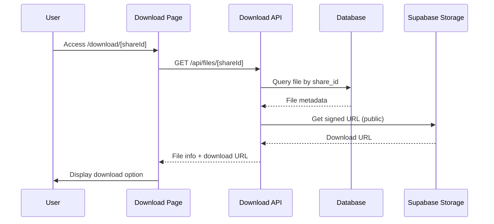

# DropLink Storage RLS Policy Violation Fix

## Overview

The DropLink application is experiencing a critical storage RLS (Row Level Security) policy violation error when users attempt to upload files to Supabase Storage. The error "new row violates row-level security policy" with status 403 indicates that the Supabase client is not properly authenticated when performing storage operations.

**Root Cause**: The Supabase client in `lib/supabaseClient.ts` is initialized with the anonymous key and doesn't maintain user authentication context, causing storage bucket policies to reject file upload operations.

## Current Architecture Analysis

### Authentication Flow


### Current Implementation Issues

| Component | Issue | Impact |
|-----------|-------|--------|
| `supabaseClient.ts` | Uses anonymous key only | Storage operations fail authentication |
| Upload API Route | Validates user but uses anonymous client | RLS policies reject operations |
| FileUpload Component | Passes token in header but client ignores it | Authentication context lost |

## Technical Solution Architecture

### 1. Authenticated Supabase Client Pattern

**Server-Side Authentication Pattern**:


### 2. Client Configuration Strategy

**Multi-Client Approach**:
- **Anonymous Client**: Public operations (downloads, metadata queries)
- **Authenticated Client**: User-specific operations (uploads, file management)

### 3. Storage Bucket Policy Requirements

**Current RLS Policies Needed**:
```sql
-- Storage bucket policies for 'uploads' bucket
CREATE POLICY "Authenticated users can upload" ON storage.objects
FOR INSERT WITH CHECK (auth.uid() IS NOT NULL);

CREATE POLICY "Users can manage own files" ON storage.objects
FOR ALL USING (auth.uid()::text = (storage.foldername(name))[1]);

CREATE POLICY "Public file downloads" ON storage.objects
FOR SELECT USING (true);
```

## Implementation Plan

### Phase 1: Authentication Context Management

#### 1.1 Enhanced Supabase Client Utilities
Create authentication-aware client factory:

**Function Specifications**:
- `createAuthenticatedClient(token: string)`: Returns authenticated client
- `getAuthenticatedUser(client)`: Validates and returns user context
- `validateStorageAccess(userId, filePath)`: Checks upload permissions

#### 1.2 API Route Authentication Middleware
Standardize authentication across all API routes:

**Middleware Components**:
- Token extraction and validation
- Authenticated client creation
- User context preservation
- Error handling for auth failures

### Phase 2: Storage Operation Refactoring

#### 2.1 Upload API Enhancement


**Key Changes**:
- Use authenticated client for all storage operations
- Implement proper file path structure (`userId/timestamp_filename`)
- Add comprehensive error handling for RLS violations
- Validate storage bucket accessibility

#### 2.2 File Management Operations
Update all file-related API routes:
- `/api/files` - List user files
- `/api/files/[shareId]` - File metadata operations
- `/api/download/[shareId]` - Download operations

### Phase 3: Frontend Integration

#### 3.1 FileUpload Component Updates
**Authentication Flow**:


**Component Enhancements**:
- Real-time authentication status monitoring
- Session token management
- Proper error handling for auth failures
- User feedback for RLS policy violations

#### 3.2 Error Handling Strategy
**Error Categories**:
- **Authentication Errors**: Token expired, invalid session
- **Authorization Errors**: RLS policy violations, insufficient permissions
- **Storage Errors**: Bucket unavailable, quota exceeded
- **Validation Errors**: File type, size restrictions

## Storage Bucket Configuration

### Required Bucket Policies

#### Upload Bucket (`uploads`)
```sql
-- Enable RLS on storage.objects
ALTER TABLE storage.objects ENABLE ROW LEVEL SECURITY;

-- Allow authenticated users to upload files
CREATE POLICY "Authenticated upload access" ON storage.objects
  FOR INSERT 
  WITH CHECK (auth.uid() IS NOT NULL);

-- Users can only access their own folders
CREATE POLICY "User folder access" ON storage.objects
  FOR ALL 
  USING (auth.uid()::text = (string_to_array(name, '/'))[1]);

-- Public read access for downloads
CREATE POLICY "Public download access" ON storage.objects
  FOR SELECT 
  USING (bucket_id = 'uploads');
```

### Folder Structure
```
uploads/
├── {user_id_1}/
│   ├── timestamp1_file1.pdf
│   └── timestamp2_file2.jpg
├── {user_id_2}/
│   ├── timestamp3_file3.mp4
│   └── timestamp4_file4.doc
└── ...
```

## Security Considerations

### 1. Token Management
- **Server-Side**: Validate tokens on every request
- **Client-Side**: Handle token expiration gracefully
- **Storage**: Never expose service role keys to frontend

### 2. File Access Control
- **Upload**: Authenticated users to own folders only
- **Download**: Public access via share_id system
- **Deletion**: Users can only delete own files

### 3. RLS Policy Validation
**Testing Checklist**:
- [ ] Authenticated upload works
- [ ] Cross-user access blocked
- [ ] Public download accessible
- [ ] Expired session handling
- [ ] Invalid token rejection

## Data Flow Architecture

### Upload Process


### Download Process


## Testing Strategy

### Unit Tests
- Authentication client creation
- Token validation functions
- RLS policy compliance
- Error handling scenarios

### Integration Tests
- End-to-end upload flow
- Cross-user access prevention
- Public download functionality
- Session expiration handling

### Manual Testing Scenarios

| Scenario | Expected Result |
|----------|----------------|
| Authenticated user uploads file | Success with proper folder structure |
| Unauthenticated upload attempt | 401 Unauthorized error |
| Expired token upload | 401 with token refresh prompt |
| Cross-user folder access | 403 RLS policy violation |
| Public download via share_id | Success without authentication |

## Performance Considerations

### Client Management
- **Connection Pooling**: Reuse authenticated clients where possible
- **Token Caching**: Avoid repeated authentication calls
- **Error Recovery**: Implement exponential backoff for failed operations

### Storage Optimization
- **File Path Indexing**: Optimize for user-based queries
- **Metadata Caching**: Cache frequently accessed file information
- **Batch Operations**: Group multiple file operations when possible